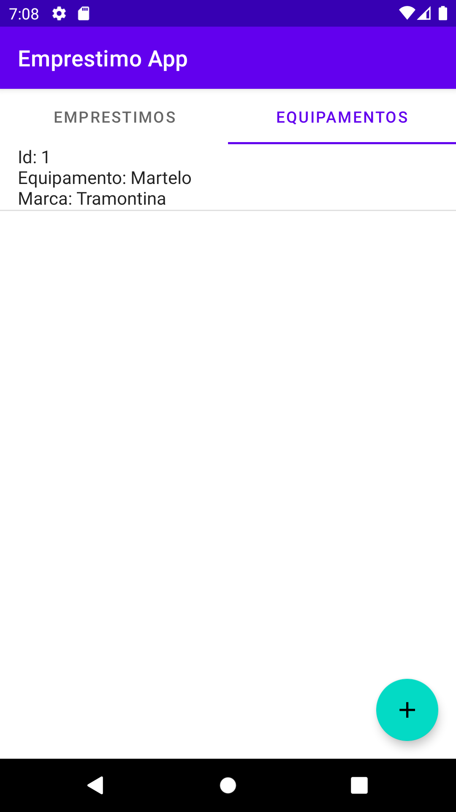
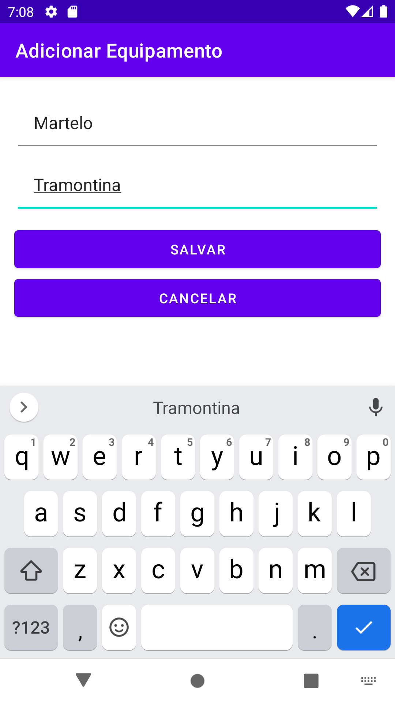
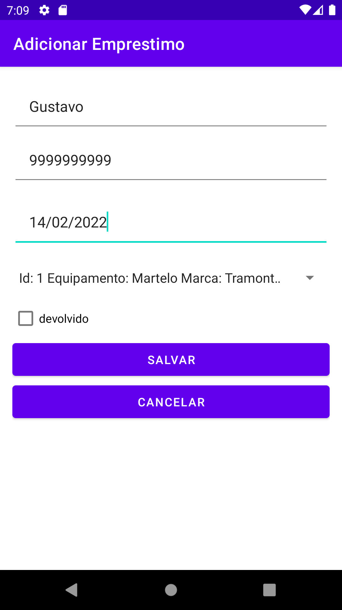
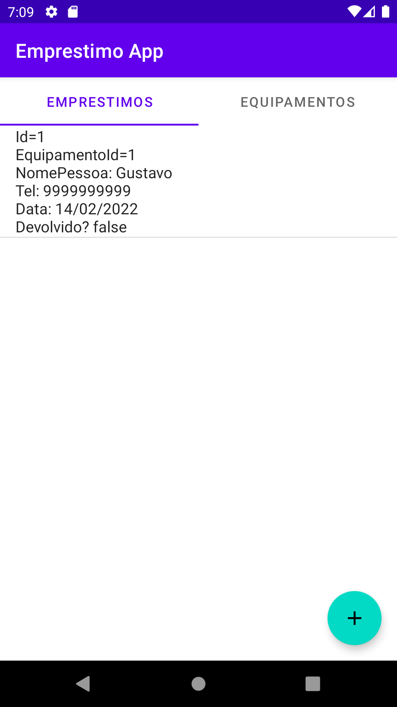

# Emprestimo App
Aplicativo de controle de empréstimos de equipamentos feito em Java para o 
Trabalho 1 da disciplina Programação para Dispositivos Móveis.

## Alunos
Alexandre Lauer Cordonet e Lucas Gomes Meneses. 

## screenshot

